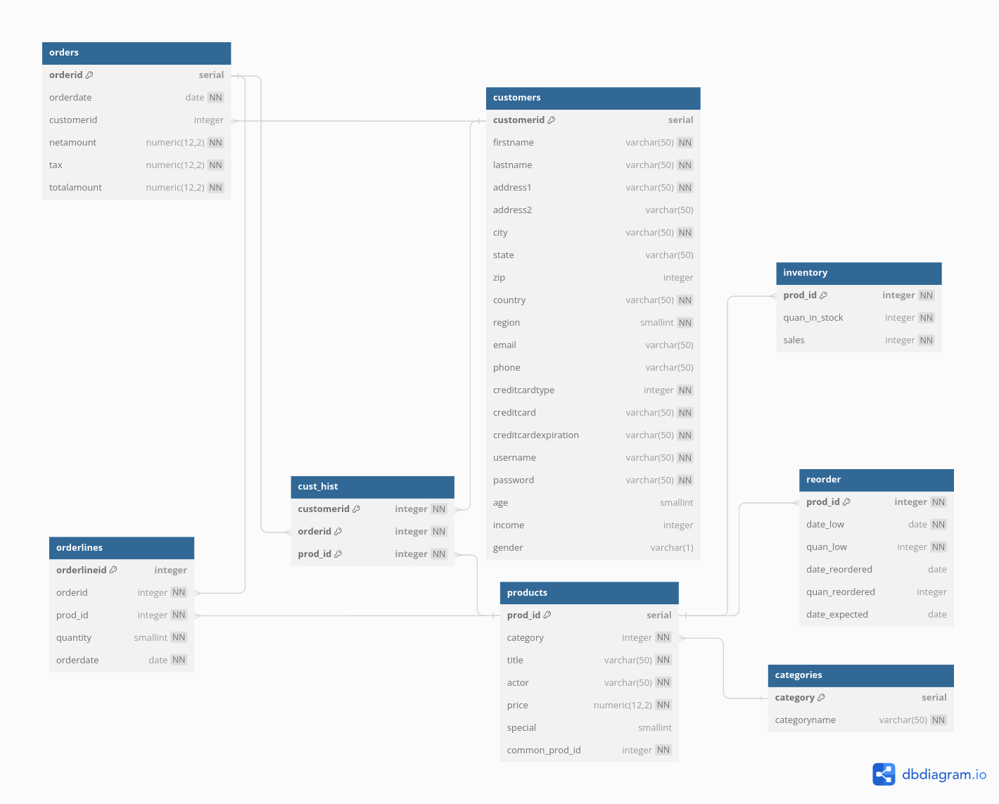
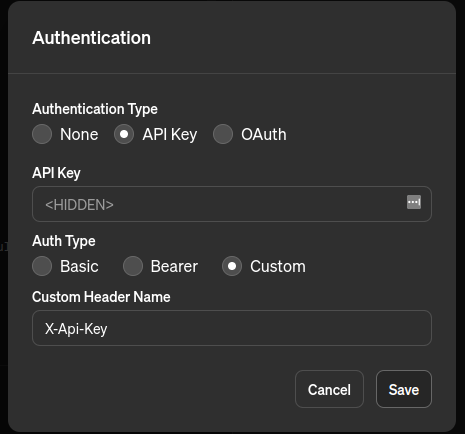

# Go SQL Query Executor

## Description

This project provides a Go application that allows you to send raw SQL queries directly to a PostgreSQL database. 
It has a single endpoint designed to receive your SQL query and return the results. The primary goal of this project 
is to demonstrate how custom GPT (Generative Pre-trained Transformer) applications can be used to interact with 
databases in innovative ways.

## How it works:

1. GPT generates a SQL query based on the user input.
2. The Go application takes the generated SQL query and executes it against the database.
3. The result of the query is returned to GPT.
4. GPT formats the result and returns it to the user.

## Prerequisites

- [Docker](https://docs.docker.com/engine/install/)
- [Docker Compose](https://docs.docker.com/compose/install/)
- [Ngrok](https://ngrok.com/download)

## Getting Started

1. Clone the repository:
    ```
    git clone https://github.com/Clasyc/gpt-db-explorer
    cd gpt-db-explorer
    ```
   
2. Create a `.env` file in the root of the project:
    ```
    mv .env.example .env
    ```

3. To build the application, launch the database, import sample data, and set up a read-only database user, execute 
   the following command:
    ```
    make run
    ```

4.  For your custom GPT model to interact with your application, the application needs to be accessible from the public internet (not just your local machine). Ngrok provides a quick and easy way to achieve this.
    ```
    ngrok http $APP_CONTAINER_PORT
    ```

## Database Schema

This project uses a sample database schema and data taken from [github.com/morenoh149/postgresDBSamples](https://github.com/morenoh149/postgresDBSamples/tree/master/dellstore2-normal-1.0).



Detailed documentation of the database schema can be found in `doc.md`. This documentation is crucial for your GPT model.
It will allow the model to generate SQL queries that are accurate and work correctly with the structure of the database.

## OpenAPI Specification

This project includes an OpenAPI specification defined in `openAPI.yml`. This file is a crucial reference for your
GPT model, as it describes the structure and details of the available API endpoint.

The OpenAPI specification will guide your GPT model in generating valid API requests and understanding the expected 
response formats.

> The OpenAPI specification contains a hardcoded URL. Before using it with your GPT model, replace this URL with your 
> own Ngrok URL (this ensures your GPT model connects to the correct location).

## Using an API Key for Authentication

This application uses an API key to protect its endpoint. Here's how to set it up:

1. Find Your API Key: The API key is located in the `.env` file. You can change this value if desired.
2. Add the API Key to Your GPT Model: 
   * In your custom GPT model, navigate to the Authentication section.
   * Create a custom header named `X-API-Key`.
   * Set the value of this header to the API key you found in the `.env` file.

